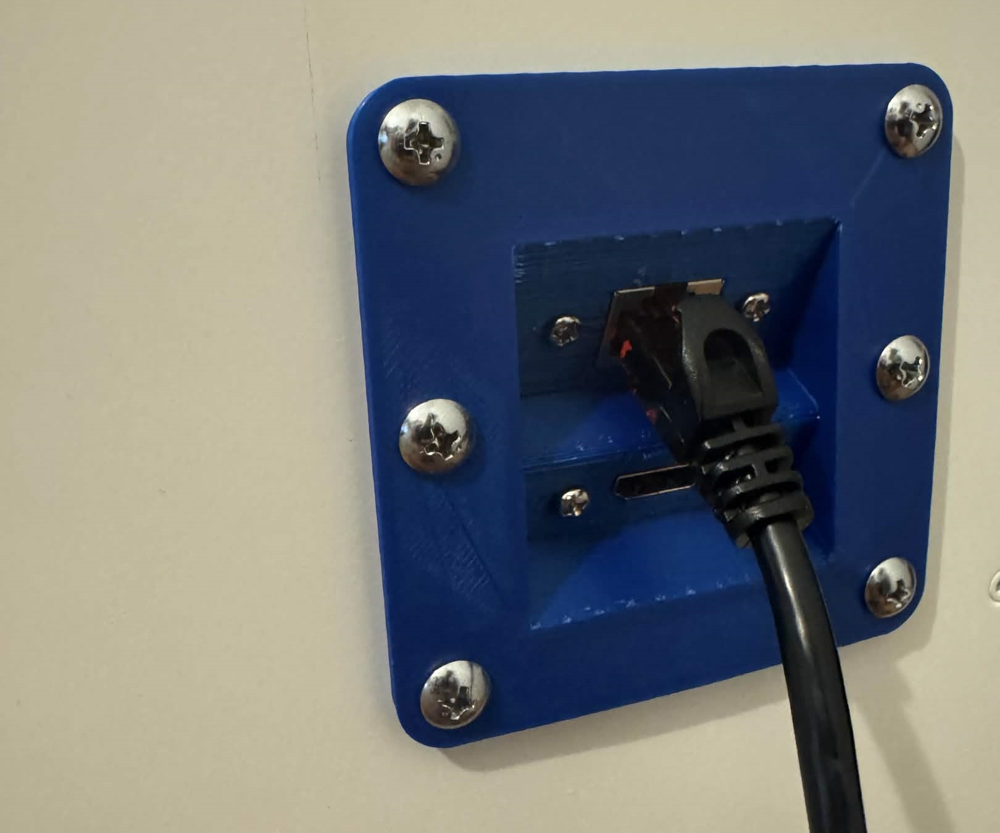
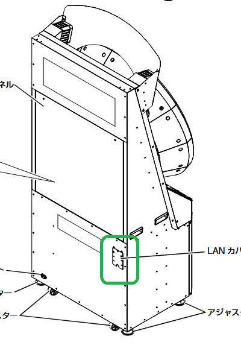

# External Port Adapter

A 3D print made by Gregorovich that replaces the metal plate covering the cutout in the back for running wires.

This will allow you to connect Ethernet / HDMI to the cabinet without having permanent long trailing cables.
Uses all 6 screws from the original plate.

<figure markdown>
<figcaption>Much better than having cables hanging out!</figcaption>
</figure>

<figure markdown>
<figcaption>This is the plate the adapter replaces on your cab.</figcaption>
</figure>

## Required Materials

- A panel mounted HDMI extension cable (like [this one](https://www.amazon.com/dp/B01MXD15TE/))
- A panel mounted Ethernet extension cable (like [this one](https://www.amazon.com/dp/B07V8G8DF2))
- [Adapter STL](../../files/3d/WACCA-ExternalPortAdapter.stl)

## Instructions

Ensure the STL matches the spacing on the screw holes and port depth of the panel mounted extension cables
you bought (the ones listed are the ones it was designed for), then print the included adapter STL.

Screw the adapter together with the extension cables, remove all 6 screws on the original metal plate,
then route the extensions through the inside of the cab, screw the adapter in, and connect the cables to the ALLS.

The adapter has the ports angled, it is recommended to make the ports face downward, but it is up to you how you decide
to mount it.

There may be a new version of this adapter STL in the future that also includes a 3.5mm jack for external audio cables.