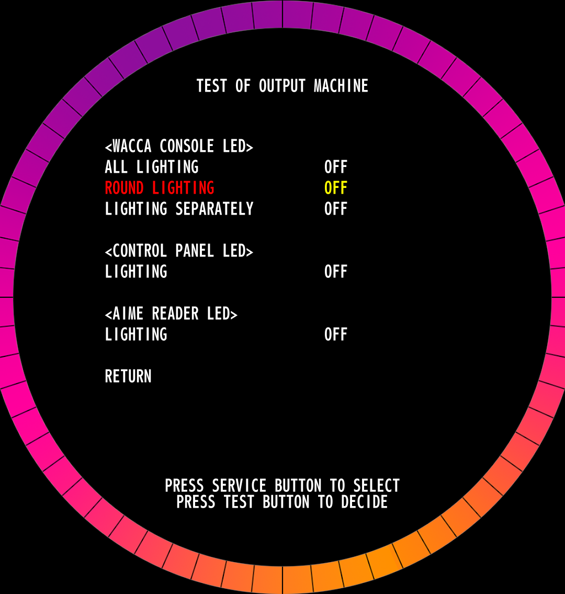

# WACCA Test Menu

The WACCA test menu has a lot of options, sometimes in confusing places. This page aims to explain what every option does. ***Not all of the options listed may be present in your version of the game.***

You can access the test menu by pressing the **TEST** button from inside the front panel of the cab when it's open.

## Test Menu

This is the menu you are initially presented with, which has a bunch of subcategories on it. You can scroll the list either by pressing the **SERVICE** button to scroll down, or use the **Volume Up and Down** buttons on the front of the cabinet next to the headphone jack (not the knob, lol). To select an item, press the **TEST** button with the item selected, which will be highlighted in red.

## Credit Log

This menu shows you how many coin credits and service credits have cycled through the machine since the last counter reset. Pretty straight forward. **Under most circumstances, you don't want to be messing with this.**

### Credits Log Initialization

This option will reset all of the credit logs on the cab. There is a warning asking you if you're sure you want to perform this action. You probably don't.
## Log

This menu has a bunch of other logging data about plays, the status of the cab, and probably the most interesting to a cab owner, a log of errors encountered.

### Total Play Log

This menu details how long the cab has been powered on, as well as play times. It provides the ratio of power on time to play time as a percentage, how many actual plays it's seen, the average time of a play session, freeplays, as well as another place that lists service credit count for some reason. 

#### Average Play Times (Daily) {: #average-play-times-daily-total }

This menu provides a daily breakdown of the average plays for every play on the cab.

#### Average Play Times (Hourly) {: #average-play-times-hourly-total }

This menu provides a hourly breakdown of the average plays for every play on the cab.

### Play Log (Within The Period)

The name of this one is kinda confusing. This menu is similar to the Total Play Log menu, but it only shows the data since the last "period reset". The theoretical use of this is to be able to get a metric of how much playtime a cab is receiving starting from when you reset it.

#### Average Play Times (Daily) {: #average-play-times-daily-period }

This menu provides a daily breakdown of the average plays for every play within the period mentioned above.

#### Average Play Times (Hourly) {: #average-play-times-hourly-period }

This menu provides a daily breakdown of the average plays for every play within the period mentioned above.

### Play Count Log

This menu allows you to look at a per-day itemized log of how many sets were played, VIP memberships (bought?? used??), boosts used, as well as freeplay sets. Seems pretty useful.

### Service Switch Log

This menu logs the date and time of the last 20 times the service switch was used to add a service credit.

### Error Log

This menu logs the date and time of the last 20 errors encountered by the cab. This is where you can see a history of both blue or red errors.

## Device Test Menu

This menu is where many of the useful test menu stuff starts to come in. Here you can perform tests on the special hardware of the cab, as well as configure some settings.

### Test of Sound-Speaker

This menu has some options to test the playback of specific sounds, as well as adjusting the in-game (**Speaker Volume**) and attract volume (**Title Demo Volume**). 

### Test of Input Machine

This menu can be used to test the individual sections on each touch panel, as well as testing the **TEST**, **SERVICE**, **Volume Up**, and **Volume Down** buttons on the cab. Each button press will start a timer to indicate for how long it was held. To exit this menu, you must press **TEST** and **SERVICE** simultaneously.

### Test of Output Machine

In this menu you can test the lighting parts of the cab. Under the WACCA Console section, **All Lighting** will test the entire console at once, **Round Lighting** will test the 8 rows of LEDS independently, and **Lighting Separately** will run through each LED in order testing either forwards or backwards in sequence.

In menus with a list of choices on an option, to start changing an option, press **SELECT**, and then use either **SELECT** or **Volume Up/Down** to change the setting, and then press **TEST** to exit the selection.

### Connection Test of Touch Device

This screen is similar to [Test of Input Machine](test-menu.md#test-of-input-machine), however this screen allows you to see the connection status of each of the 12 touch panels that make up the WACCA Console, as well as signal to the touch controller to reinitialize the touch panels, in case you disconnect one to work on it while the cab is still powered on. On this screen, you can also touch any of the panel sections to light the corresponding area on the ring displayed to test if they work and their sensitivity.

### Test of Color Display

This menu is used for display color calibration testing as well as display mounting position tests. Somewhat useful.
### Network Testing

TODO: come back and add something here.
### Test of Card Reader

This menu allows you to test the communications with the Aime card reader in the cab. You can scan cards here, and it should return success if it worked.

## Hardware Information

This menu tells you information about your cab's hardware. It provides you with the Housing ID, Aime reader firmware version, and touch controller firmware versions. 

## System Setting
TODO: this isn't done yet, sorry.

### Closing Time Setting

### Songs for 1-Play Setting

### Continue Times Settings

### Times for Free Time

### Event Mode Setting

### Language Setting (offline)

NOTE: This menu is only available in the offline mode patch, 3.10.00.
### Date and Time Setting

