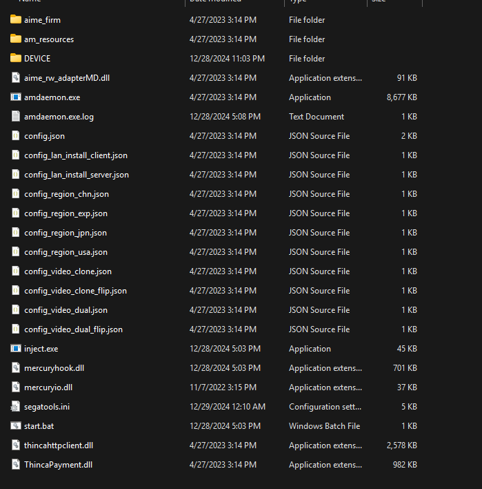

---
title: WACVR Setup
---
# WACVR Setup
## What is this?
This guide contains instructions for playing WACCA at home without owning a cabinet, using WACVR.

### Things you'll need
- [<ins>***Game files***</ins>](#archive "internet archive moment") (The guide was written for 3.10.00, but should work 
  with most versions)
- A VR headset you can connect to a computer (a Quest 3S is used for testing here)
- A VR capable computer, this is non-negotiable as there is no way to run WACVR and WACCA data on Quest headsets.
- SteamVR
- [WACVR](https://github.com/xiaopeng12138/WACVR)
- [TeamTofuShop's ST](https://gitea.tendokyu.moe/TeamTofuShop/segatools)
- [FTDI Drivers](https://ftdichip.com/wp-content/uploads/2023/09/CDM-v2.12.36.4-WHQL-Certified.zip)
- Patience, maybe some lemonade.

### Making sure your data is ready
If your data is already set up properly, you may skip the following steps and proceed to [Setting up WACVR](#setting-up-wacvr)

> WARNING: **Disclaimer**
> This process starts from freshly downloaded data with no changes to it (or "clean" data), if your data isn't clean,
> I suggest downloading a clean copy before continuing as it may cause issues later down the line.

### Setting up ST
Extract `mercury.zip` from the ST zip, and then extract the contents of `mercury.zip` into the `App/bin` folder
within your game folder, the folder should look like this:



#### Changing Configuration Files
Open `segatools.ini` in your preferred text editor and change the `vfs` settings as follows:
```ini
[vfs]
; Insert the path to the game AMFS directory here (contains ICF1 and ICF2)
amfs=..\..\amfs
; Insert the path to the game Option directory here (contains Axxx directories)
option=
; Create an empty directory somewhere and insert the path here.
; This directory may be shared between multiple SEGA games.
; NOTE: This has nothing to do with Windows %APPDATA%.
appdata=..\..\appdata
```
(`option` is blank on purpose, WACCA does not use option files)

You will also need to change the `mercuryio` section as follows:
```ini
[mercuryio]
; To use a custom WACCA IO DLL enter its path here.
; Leave empty if you want to use Segatools built-in keyboard input.
path=mercuryio.dll
```

#### FTDI Drivers
**This step is REQUIRED for WACCA to launch or else it'll just error out.**

These drivers are used for the board that controls the LED strips on the console. It is required for lights to work.

Open the FTDI driver archive, extract `CDM-v2.12.36.4-WHQL-Certified/amd64/ftd2xx64.dll` to 
`/App/WindowsNoEditor/Mercury/Binaries/Win64` and rename it to `ftd2xx.dll`.

#### Offline mode
> NOTE: 
> This part is only required if you are not using 3.10.00, as that version is always offline.

If you do not plan on connecting your game to a server to save scores and have a profile, you can enable offline mode.

Navigate to `App\WindowsNoEditor\Mercury\Config` and open `DefaultHardware.ini` and change `OfflineMode` to `true`

**Now launch start.bat and the game should go through the startup process without a hitch.**

### Setting up WACVR
> DANGER: **DO NOT USE THE AUTOMATED SETUP**
> It has been broken for years and does not set things up correctly.

Extract WACVR somewhere, and copy the `mercuryio.dll` file to the `App/bin` folder in your game folder.

> DANGER: **Intel CPU Bug**
> If you have an Intel Core 10th gen or newer CPU, you need to edit `start.bat` in the `App/bin` folder, and add this
> after the `@echo off` line:
> ```
> set OPENSSL_ia32cap=:~0x20000000
> ```
> If you don't do this, the game will crash a few minutes after starting.

Start up your VR software as well as SteamVR, then launch WACVR, followed by WACCA.
WACVR should connect to WACCA when it starts.

> WARNING: **Disclaimer**
> If your experiencing a warped screen in WACVR, set your monitor to portrait mode 1080p and check 
> `Full Display Capture` in WACVR, I have no clue why this happens, but this is the solution that works for me.
