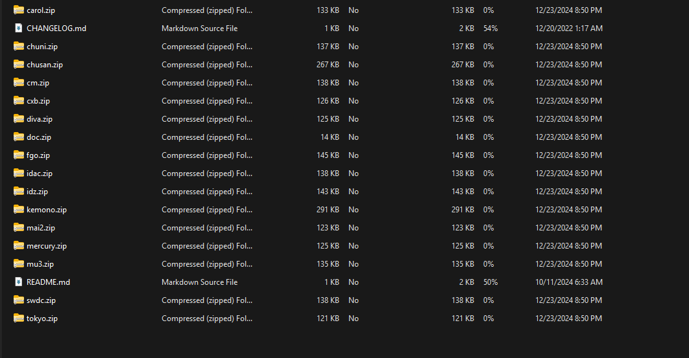

---
title: WACVR Setup
---
# WACVR Setup
## What is this?
This is a guide explaining how to play WACCA at home without owning a cabinet, while there are a multitude of ways to go about this, we have come to the conclusion that using WACVR and data is the best and most accurate way of playing.

> DANGER: **Important!**
> I will not list instructions on where to obtain data, do not ask us where to get data,
> we will NOT provide it.

### Things you'll need
- WACCA data of preferably the latest available version (SDFE 3.10.00 being the version used for testing)
- a VR headset of any  kind (a Quest 3S is used for testing here)
- a VR capable computer, this is non-negotiable as there is no way to run WACVR and WACCA data on Quest headsets.
- SteamVR
- [WACVR](https://github.com/xiaopeng12138/WACVR)
- Patience, maybe some lemonade.

### Making sure your data is ready
If your data is already in a state of starting to the main WACCA screen, you may skip the following steps and proceed to [Setting up WACVR](#setting-up-wacvr)

> WARNING: **Disclaimer**
> This process starts from freshly downloaded data with no changes to it (or "clean" data), if your data isn't clean, I suggest cleaning it up before continuing as it may cause issues later down the line.

### Setting up Segatools
Download Segatools from [here](https://gitea.tendokyu.moe/TeamTofuShop/segatools) and extract to a folder of your choice.
you should see many individual zip files as shown below, the one we want is `mercury.zip`

<figure markdown>
</figure>

extract to the `app/bin` in your data folder, the folder should look like this (excluding the DEVICE folder) 

<figure markdown>
</figure>

#### Changing Configuration Files

Open `segatools.ini` in your preferred text editor and change the following settings:

    ; Insert the path to the game AMFS directory here (contains ICF1 and ICF2)
    amfs=..\..\amfs
    ; Insert the path to the game AMFS directory here (contains ICF1 and ICF2)
    amfs=..\..\amfs  
    ; Insert the path to the game Option directory here (contains Axxx directories)
    option=..\..\option
    ; Create an empty directory somewhere and insert the path here.
    ; This directory may be shared between multiple SEGA games.
    ; NOTE: This has nothing to do with Windows %APPDATA%.
    appdata=..\..\appdata
    
   as well as:
   

    [mercuryio]
    ; To use a custom WACCA IO DLL enter its path here.
    ; Leave empty if you want to use Segatools built-in keyboard input.
    path=mercuryio.dll
  

#### FTDI Drivers
**This step is REQUIRED for WACCA to launch or else it'll just error out.**

These drivers seem to be used for the board that controls the LED strips on the console.

Download FTDI drivers from [here](https://ftdichip.com/wp-content/uploads/2023/09/CDM-v2.12.36.4-WHQL-Certified.zip) and extract them to a folder of your choice, then copy ``CDM-v2.12.36.4-WHQL-Certified/amd64/ftd2xx64.dll``to `/App/WindowsNoEditor/Mercury/Binaries/Win64` and then rename the file to ``ftd2xx.dll``

#### Offline mode
This is if you don't wanna deal with network setup and just wanna play the game:

Navigate to `App\WindowsNoEditor\Mercury\Config` and open `DefaultHardware.ini` and change `OfflineMode` to `true`

**Now launch start.bat and the game should go through the startup process without a hitch.**

### Setting up WACVR
Download WACVR from [here](https://github.com/xiaopeng12138/WACVR) and extract to a folder of your choice

copy the `mercuryio.ini` file to the the `App/bin` folder in your data folder

Start up your VR software as well as SteamVR, then launch WACCA and WACVR
WACVR should set up with WACCA automatically.

> WARNING: **Disclaimer**
> If your experiencing a warped screen in WACVR, set your monitor to portrait mode and check the full display capture box in WACVR, I have no clue why this happens, but this is the solution that works for me.

